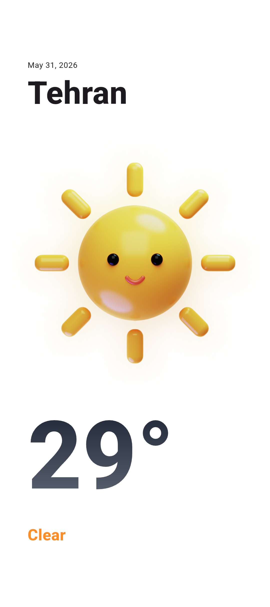
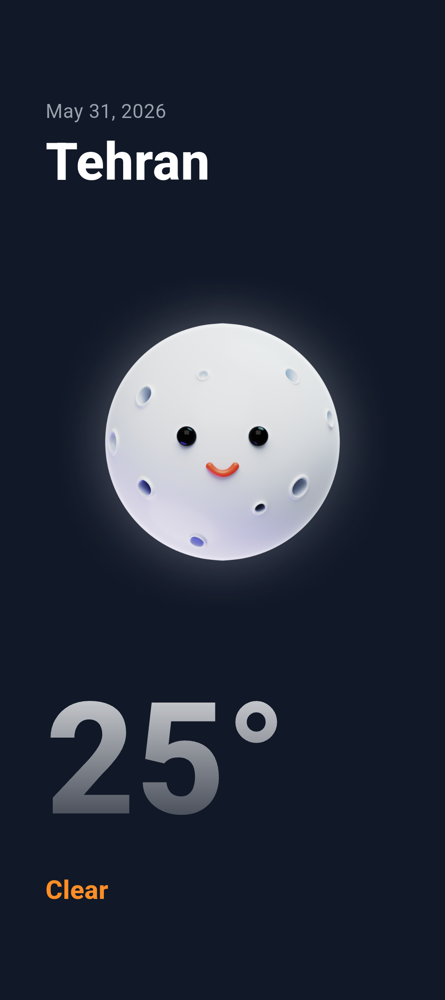

# Weather App with BLoC

A Flutter weather application built with **Clean Architecture**, **BLoC state management**, and the **OpenWeatherMap API**. Search for any city and view current weather conditions through a clean, responsive UI with dynamic light and dark themes.

---

## Preview

| Light Theme | Dark Theme |
|-------------|------------|
|  |  |

The UI adapts to weather conditions — sunny days use a bright palette with a 3D sun illustration, while clear nights switch to a dark theme with a moon icon.

---

## Features

- Search weather by city name
- Display current temperature, humidity, wind speed, and condition
- Dynamic light / dark theme based on time of day
- Custom 3D weather illustrations per condition
- Robust error handling (no connection, city not found, timeouts, rate limits)
- Secure API key storage via `.env`

---

## Tech Stack

| Category | Tools |
|----------|-------|
| Framework | Flutter, Dart |
| State Management | flutter_bloc |
| Networking | Dio |
| Architecture | Clean Architecture (Domain / Data / Presentation) |
| DI | GetIt |
| Functional Programming | Dartz |
| Config | flutter_dotenv |
| Formatting | intl |

---

## Architecture

The project follows **Clean Architecture** with clear separation of concerns:

```
lib/
├── core/
│   ├── di/           # Dependency injection (GetIt)
│   ├── network/      # Dio client configuration
│   └── theme/        # Light & dark app themes
│
├── data/
│   ├── datasourse/   # Remote data sources
│   ├── dto/          # API response models
│   ├── mapper/       # DTO → Entity mappers
│   └── repositories/ # Repository implementations
│
├── domain/
│   ├── entities/     # Business models
│   ├── repositories/ # Repository contracts
│   └── usecase/      # Business logic
│
├── presentation/
│   ├── screen/       # UI screens
│   ├── weather_bloc/ # Weather state management
│   ├── theme_bloc/   # Theme state management
│   └── extensions/   # UI helpers
│
└── main.dart
```

### Data Flow

```
UI → BLoC → UseCase → Repository → Remote DataSource → OpenWeatherMap API
```

---

## Getting Started

### Prerequisites

- [Flutter SDK](https://docs.flutter.dev/get-started/install) (Dart ^3.12)
- An [OpenWeatherMap API key](https://openweathermap.org/api)

### Installation

1. **Clone the repository**

   ```bash
   git clone https://github.com/your-username/weather_app_with_bloc.git
   cd weather_app_with_bloc
   ```

2. **Install dependencies**

   ```bash
   flutter pub get
   ```

3. **Configure environment variables**

   Create a `.env` file in the project root:

   ```env
   API_KEY=YOUR_OPENWEATHER_API_KEY
   ```

   > Do not commit your real API key. Add `.env` to `.gitignore` if it is not already ignored.

4. **Run the app**

   ```bash
   flutter run
   ```

---

## State Management

### Weather BLoC

| State | Description |
|-------|-------------|
| `Initial` | App just launched, no data yet |
| `Loading` | Fetching weather from API |
| `Success` | Weather data loaded and displayed |
| `Error` | Something went wrong (with user-friendly message) |

### Theme BLoC

Automatically switches between light and dark themes based on the current weather condition and time of day.

---

## Error Handling

The app gracefully handles common failure scenarios:

- No internet connection
- Request timeout
- City not found (404)
- API rate limiting
- Server errors (5xx)
- Unexpected exceptions

---

## Assets

Weather illustrations are stored in `assets/images/` and mapped to conditions via `weather_condition_ui.dart`.

---

## Author

**Ali Asghar Zare** — Flutter Developer

---

## License

This project is licensed under the MIT License.
